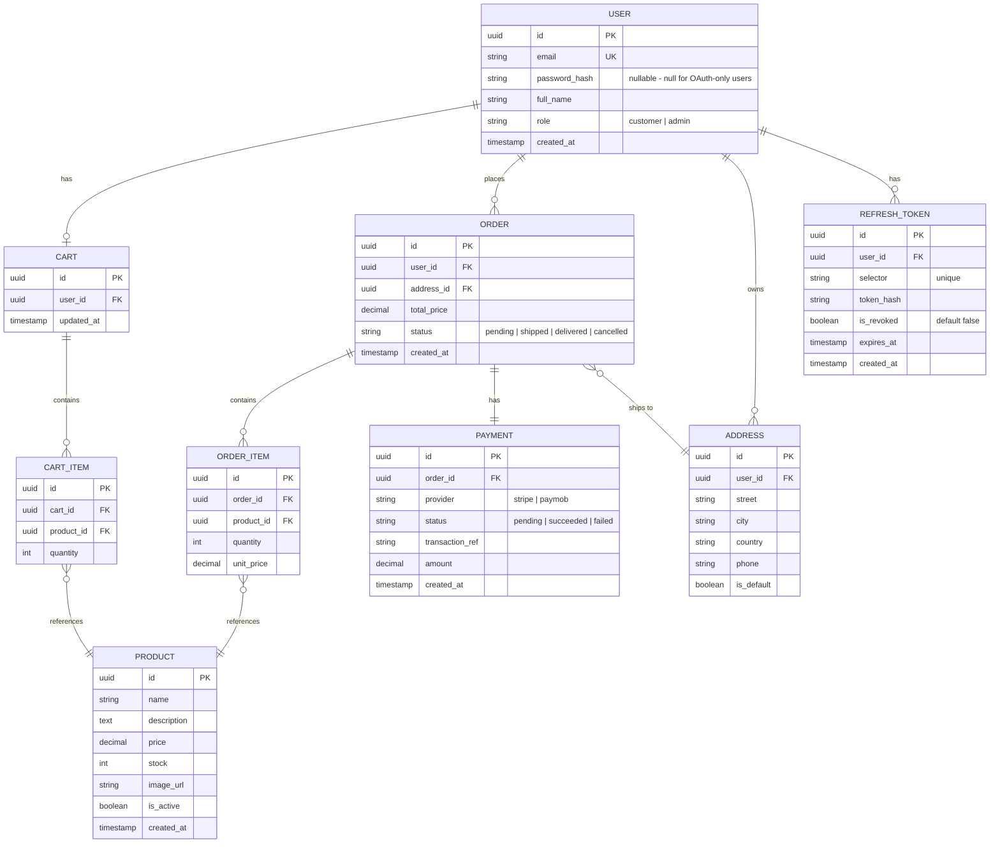

# Entity Relationship Diagram (ERD)

## E-commerce Store — Nest.js (Backend) + Next.js (Frontend)

Based on the PRD and User Stories: single product category, Customer + Admin roles, cart persisted per user, checkout via a real payment gateway (test mode).

---

## 1. Diagram

---

## 2. Entities Overview

| Entity        | Purpose                                                                                                           |
| ------------- | ----------------------------------------------------------------------------------------------------------------- |
| **User**      | Customers and Admins (differentiated by `role`)                                                                   |
| **Address**   | Shipping addresses linked to a user                                                                               |
| **Product**   | Store items (single category, so no separate Category table needed)                                               |
| **Cart**      | One active cart per user                                                                                          |
| **CartItem**  | Products inside a user's cart, with quantity                                                                      |
| **Order**     | A confirmed purchase, snapshot of cart at checkout time                                                           |
| **OrderItem** | Line items of an order, storing `unit_price` at time of purchase (so later price changes don't affect old orders) |
| **Payment**   | Payment attempt/result tied to an order                                                                           |

---

## 3. Key Design Decisions

- **`unit_price` is duplicated in `OrderItem`** instead of always reading from `Product`, so historical orders stay accurate even if the product price changes later.
- **`Cart` is one-to-one with `User`** (a user has a single active cart) — simpler than session-based carts since all customers are logged in.
- **`Order` and `Payment` are one-to-one** — one payment attempt per order in this phase. If you later support retries, this can become one-to-many.
- **No `Category` table** — since the store sells a single product category, this avoids unnecessary complexity for phase 1. Easy to add later if the store expands.
- **`Address` is a separate table** (not embedded in `Order`) so users can save and reuse multiple addresses, while `Order.address_id` still snapshots which one was used.

---

## 4. Relationships Summary

- One `User` → one `Cart`
- One `User` → many `Address`
- One `User` → many `Order`
- One `Cart` → many `CartItem`
- One `Order` → many `OrderItem`
- One `Order` → one `Payment`
- `CartItem` and `OrderItem` each reference one `Product`
