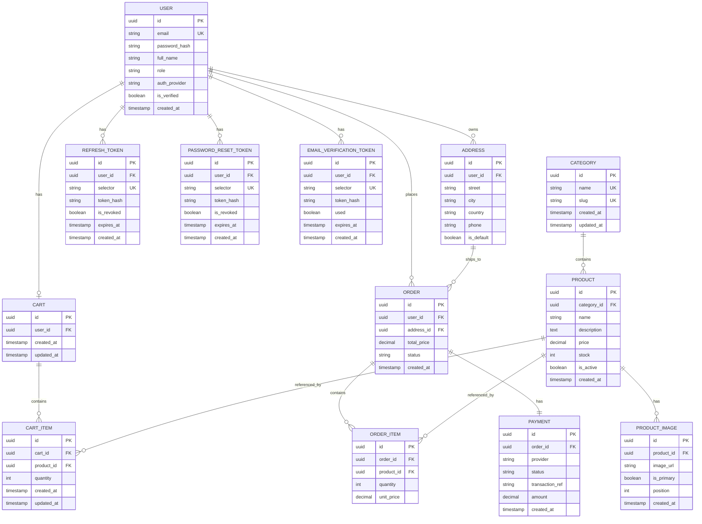

## 1. Diagram


```mermaid

erDiagram

    USER ||--o| CART : has
    USER ||--o{ ORDER : places
    USER ||--o{ ADDRESS : owns
    USER ||--o{ REFRESH_TOKEN : has
    USER ||--o{ PASSWORD_RESET_TOKEN : has
    USER ||--o{ EMAIL_VERIFICATION_TOKEN : has

    CATEGORY ||--o{ PRODUCT : contains
    PRODUCT ||--o{ PRODUCT_IMAGE : has

    CART ||--o{ CART_ITEM : contains
    PRODUCT ||--o{ CART_ITEM : referenced_by

    ORDER ||--o{ ORDER_ITEM : contains
    PRODUCT ||--o{ ORDER_ITEM : referenced_by

    ORDER ||--|| PAYMENT : has
    ADDRESS ||--o{ ORDER : ships_to

    USER {
        uuid id PK
        string email UK
        string password_hash
        string full_name
        string role
        string auth_provider
        boolean is_verified
        timestamp created_at
    }

    ADDRESS {
        uuid id PK
        uuid user_id FK
        string street
        string city
        string country
        string phone
        boolean is_default
    }

    CATEGORY {
        uuid id PK
        string name UK
        string slug UK
        timestamp created_at
        timestamp updated_at
    }

    PRODUCT {
        uuid id PK
        uuid category_id FK
        string name
        text description
        decimal price
        int stock
        boolean is_active
        timestamp created_at
    }

    PRODUCT_IMAGE {
        uuid id PK
        uuid product_id FK
        string image_url
        boolean is_primary
        int position
        timestamp created_at
    }

    CART {
        uuid id PK
        uuid user_id FK
        timestamp created_at
        timestamp updated_at
    }

    CART_ITEM {
        uuid id PK
        uuid cart_id FK
        uuid product_id FK
        int quantity
        timestamp created_at
        timestamp updated_at
    }

    ORDER {
        uuid id PK
        uuid user_id FK
        uuid address_id FK
        decimal total_price
        string status
        timestamp created_at
    }

    ORDER_ITEM {
        uuid id PK
        uuid order_id FK
        uuid product_id FK
        int quantity
        decimal unit_price
    }

    PAYMENT {
        uuid id PK
        uuid order_id FK
        string provider
        string status
        string transaction_ref
        decimal amount
        timestamp created_at
    }

    REFRESH_TOKEN {
        uuid id PK
        uuid user_id FK
        string selector UK
        string token_hash
        boolean is_revoked
        timestamp expires_at
        timestamp created_at
    }

    PASSWORD_RESET_TOKEN {
        uuid id PK
        uuid user_id FK
        string selector UK
        string token_hash
        boolean is_revoked
        timestamp expires_at
        timestamp created_at
    }

    EMAIL_VERIFICATION_TOKEN {
        uuid id PK
        uuid user_id FK
        string selector UK
        string token_hash
        boolean used
        timestamp expires_at
        timestamp created_at
    }
```

---

## 2. Entities Overview

| Entity                     | Purpose                                                               |
| -------------------------- | --------------------------------------------------------------------- |
| **User**                   | Customers and Admins, differentiated by `role`                        |
| **Address**                | Shipping addresses linked to a user                                   |
| **Category**               | Groups products into categories; each product belongs to one category |
| **Product**                | Store items belonging to a single category                            |
| **ProductImage**           | One or more images per product, with a primary flag and display order |
| **Cart**                   | One active cart per user                                              |
| **CartItem**               | Products inside a user's cart, with quantity                          |
| **Order**                  | A confirmed purchase, snapshot of cart at checkout time               |
| **OrderItem**              | Line items of an order, storing `unit_price` at time of purchase      |
| **Payment**                | Payment attempt/result tied to an order                               |
| **RefreshToken**           | Stores refresh-token sessions securely using selector + hash          |
| **PasswordResetToken**     | Temporary tokens used for password reset                              |
| **EmailVerificationToken** | Tokens used to verify user email addresses                            |

---

## 3. Key Design Decisions

- **`Category` → `Product` is one-to-many.**
  Each product belongs to one category, while a category can contain many products.

- **`Product` stores `category_id` as a foreign key** instead of using a many-to-many relationship. This keeps the first version simple and matches the current store design.

- **`unit_price` is duplicated in `OrderItem`** instead of always reading from `Product`, so historical orders stay accurate even if the product price changes later.

- **`Cart` is one-to-one with `User`** — a user has a single active cart.

- **`CartItem` has a unique `(cart_id, product_id)` constraint**, so the same product cannot appear twice in the same cart. Adding an existing product increases its `quantity`.

- **Cart does not reserve stock.** Stock is checked when adding/updating cart items, while actual stock deduction should happen during checkout/order creation.

- **`Order` and `Payment` are one-to-one** — one payment record per order in this phase. If payment retries are supported later, this can become one-to-many.

- **`Address` is a separate table** so users can save and reuse multiple addresses. `Order.address_id` identifies the address selected for that order.

- **`ProductImage` is a separate table** so each product can have multiple images. `is_primary` identifies the main image and `position` controls display order.

- **Deleting a Product cascades to its ProductImages** at the database level.

- **Deleting a Cart cascades to its CartItems.**

- **Deleting a Product currently cascades to its CartItems** through the `product_id` foreign key.

- **Physical product image files are not handled by database cascade.** The application deletes the physical files separately before deleting the corresponding database records.

---

## 4. Relationships Summary

- One `User` → one `Cart`

- One `User` → many `Address`

- One `User` → many `Order`

- One `User` → many `RefreshToken`

- One `User` → many `PasswordResetToken`

- One `User` → many `EmailVerificationToken`

- One `Category` → many `Product`

- One `Product` → one `Category`

- One `Cart` → many `CartItem`

- One `CartItem` → one `Product`

- One `Order` → many `OrderItem`

- One `OrderItem` → one `Product`

- One `Order` → one `Payment`

- One `Order` → one `Address`

- One `Product` → many `ProductImage`

### Important Constraints

```text
User
  └── Cart
       UNIQUE(user_id)

Cart
  └── CartItem
       UNIQUE(cart_id, product_id)

Category
  └── Product
       Product.category_id → Category.id

Product
  └── ProductImage
       ProductImage.product_id → Product.id
       ON DELETE CASCADE
```
